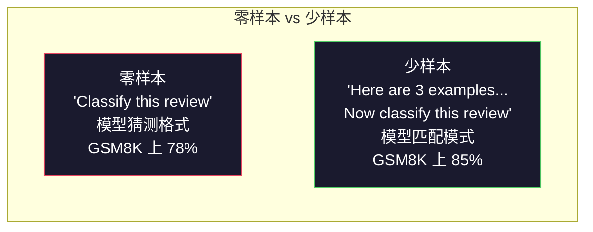
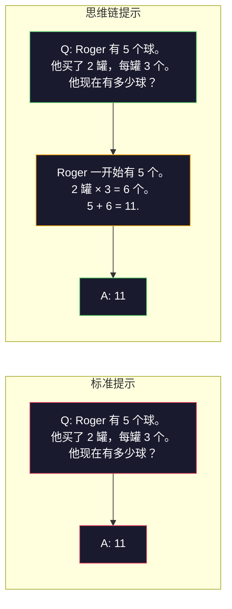
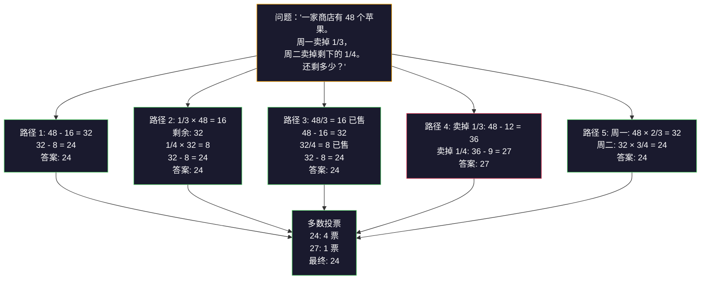
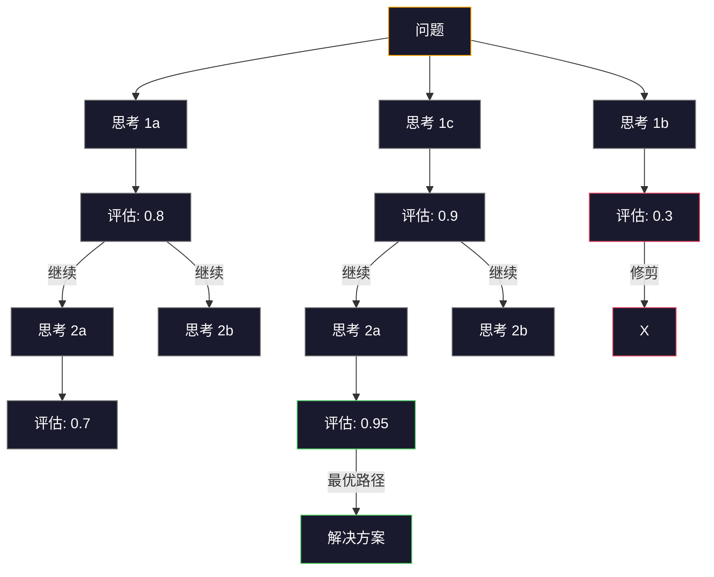

# Few-Shot、Chain-of-Thought、Tree-of-Thought

> 告诉模型该做什么是提示，教它如何思考才是工程。同一个模型、同一个任务、同一份数据上 78% 和 91% 准确率之间的差距，不是因为更好的模型，而是因为更好的推理策略。

**类型：** Build
**语言：** Python
**前置课程：** Lesson 11.01（Prompt Engineering）
**时间：** ~45 分钟

## 学习目标

- 通过选择和格式化示例演示来实现少样本提示，以最大化任务准确率
- 运用思维链（CoT）推理来提高数学应用题等多步骤问题的准确率
- 构建思维树（Tree-of-Thought）提示，探索多条推理路径并选择最优路径
- 在标准基准测试上衡量零样本、少样本和 CoT 之间的准确率提升

## 问题所在

你正在构建一个数学辅导应用。你的提示词说："Solve this word problem." GPT-5 在 GSM8K（标准小学数学基准测试）上答对率已达 94%。你以为已经到顶了——其实没有，思维链仍然能再提升 3-4 个百分点。

加上五个词——"Let's think step by step"——准确率跳升到 91%。再加几个完整示例，达到 95%。相同的模型，相同的温度，相同的 API 成本。唯一的区别是你给了模型草稿纸。

这不是一种技巧。这就是推理的工作方式。人类不会在一个思维飞跃中解决多步骤问题，Transformer 也不会。当你强制模型生成中间 token 时，这些 token 就成为下一个 token 的上下文的一部分。每个推理步骤都为下一步提供输入。模型是真正在计算中得出答案的。

但"think step by step"只是开始，不是终点。如果你采样五条推理路径然后取多数投票怎么办？如果你让模型探索可能性树，评估和修剪分支怎么办？如果你将推理与工具使用交织在一起怎么办？这些都不是假设。它们是经过验证、有实测改进的发表技术，你将在本课中全部构建。

## 核心概念

### 零样本 vs 少样本：何时示例胜过指令

零样本提示（Zero-shot）只给模型任务，不给其他任何东西。少样本提示（Few-shot）先给它示例。

Wei et al.（2022）在 8 个基准测试上测量了这一点。对于情感分类等简单任务，零样本和少样本的性能差距在 2% 以内。对于多步算术和符号推理等复杂任务，少样本将准确率提高了 10-25%。

直觉理解：示例是压缩的指令。你不是描述输出格式，而是展示它。不是解释推理过程，而是演示它。模型对示例的模式匹配比它解读抽象指令更可靠。



**少样本胜出的场景：** 格式敏感任务、分类、结构化提取、领域特定术语、任何需要模型匹配特定模式的任务。

**零样本胜出的场景：** 简单事实性问题、示例会限制创造力的创意任务、找到好示例比写好指令更难的任务。

### 示例选择：相似胜过随机

并非所有示例都一样。在分类任务上，选择与目标输入相似的示例比随机选择高 5-15%（Liu et al., 2022）。三个原则：

1. **语义相似性**：在嵌入空间中选择与输入最接近的示例
2. **标签多样性**：在示例中覆盖所有输出类别
3. **难度匹配**：匹配目标问题的复杂度水平

大多数任务的最佳示例数量是 3-5 个。低于 3 个，模型没有足够的信号来提取模式。高于 5 个，收益递减且浪费上下文窗口 token。对于标签很多的分类任务，每个标签使用一个示例。

### 思维链（Chain-of-Thought）：给模型草稿纸

思维链（CoT）提示由 Wei et al.（2022）在 Google Brain 提出。思路很简单：不要只问模型要答案，先让它展示推理步骤。



为什么这在机制上有效？Transformer 生成的每个 token 都成为下一个 token 的上下文。没有 CoT 时，模型必须将所有推理压缩到单次前向传播的隐藏状态中。有了 CoT，模型将中间计算外化为 token。每个推理 token 都扩展了有效计算深度。

**GSM8K 基准测试（小学数学，8.5K 道题）：**

| 模型 | 零样本 | 零样本 CoT | 少样本 CoT |
|------|--------|-----------|-----------|
| GPT-4o | 78% | 91% | 95% |
| GPT-5 | 94% | 97% | 98% |
| o4-mini（推理模型） | 97% | — | — |
| Claude Opus 4.7 | 93% | 97% | 98% |
| Gemini 3 Pro | 92% | 96% | 98% |
| Llama 4 70B | 80% | 89% | 94% |
| DeepSeek-V3.1 | 89% | 94% | 96% |

**关于推理模型的说明。** OpenAI 的 o 系列（o3、o4-mini）和 DeepSeek-R1 等模型会在输出答案之前内部运行思维链。给推理模型添加"Let's think step by step"是多余的，有时甚至适得其反——它们已经这样做了。

CoT 有两种形式：

**零样本 CoT**：在提示词末尾追加"Let's think step by step"。不需要示例。Kojima et al.（2022）表明这一句话就能在算术、常识和符号推理任务上提升准确率。

**少样本 CoT**：提供包含推理步骤的示例。比零样本 CoT 更有效，因为模型看到了你期望的精确推理格式。

**CoT 适得其反的场景：** 简单事实回忆（"法国的首都是什么？"）、单步分类、速度比准确率更重要的任务。CoT 每次查询增加 50-200 个 token 的推理开销。对于高吞吐量、低复杂度的任务，这是浪费的成本。

### 自一致性（Self-Consistency）：多次采样，一次投票

Wang et al.（2023）提出了自一致性方法。核心洞察：单条 CoT 路径可能包含推理错误。但如果你采样 N 条独立的推理路径（使用 temperature > 0）并对最终答案取多数投票，错误会被抵消。



在原始 PaLM 540B 实验中，自一致性将 GSM8K 准确率从 56.5%（单条 CoT）提升到 N=40 时的 74.4%。在 GPT-5 上提升很小（97% 到 98%），因为基础准确率已经饱和。该技术在基础 CoT 准确率为 60-85% 的模型上效果最显著——这是单路径错误频繁但不系统的最佳区间。对于推理模型（o 系列、R1），自一致性被内置的内部采样所取代。

权衡：N 次采样意味着 N 倍的 API 成本和延迟。实践中，N=5 可以捕获大部分收益。N=3 是有意义投票的最低要求。N > 10 对大多数任务收益递减。

### 思维树（Tree-of-Thought）：分支探索

Yao et al.（2023）提出了思维树（ToT）。CoT 沿着一条线性推理路径前进，而 ToT 探索多个分支并在继续之前评估哪些最有前途。



ToT 有三个组成部分：

1. **思考生成（Thought generation）**：产生多个候选下一步
2. **状态评估（State evaluation）**：对每个候选评分（可以使用 LLM 本身作为评估器）
3. **搜索算法（Search algorithm）**：通过树进行 BFS 或 DFS，修剪低分分支

在 Game of 24 任务（用算术运算组合 4 个数字得到 24）上，GPT-4 使用标准提示只能解决 7.3% 的问题。使用 CoT，4.0%（CoT 在这里实际上是有害的，因为搜索空间太大）。使用 ToT，74%。

ToT 是昂贵的。树中的每个节点都需要一次 LLM 调用。分支因子为 3、深度为 3 的树最多需要 39 次 LLM 调用。仅在搜索空间大但可评估的问题上使用——规划、解谜、带约束的创造性问题解决。

### ReAct：思考 + 行动

Yao et al.（2022）将推理轨迹与行动结合。模型在思考（生成推理）和行动（调用工具、搜索、计算）之间交替进行。

```mermaid
graph LR
    Q["问题：\n埃菲尔铁塔所在\n国家的人口\n是多少？"]
    T1["思考：我需要\n找到哪个国家\n有埃菲尔铁塔"]
    A1["行动：搜索\n'Eiffel Tower location'"]
    O1["观察：\nParis, France"]
    T2["思考：现在我需要\n法国的人口"]
    A2["行动：搜索\n'France population 2024'"]
    O2["观察：\n6840 万"]
    T3["思考：我有了\n答案"]
    F["答案：\n6840 万"]

    Q --> T1 --> A1 --> O1 --> T2 --> A2 --> O2 --> T3 --> F

    style Q fill:#1a1a2e,stroke:#ffa500,color:#fff
    style T1 fill:#1a1a2e,stroke:#51cf66,color:#fff
    style A1 fill:#1a1a2e,stroke:#e94560,color:#fff
    style O1 fill:#1a1a2e,stroke:#808080,color:#fff
    style T2 fill:#1a1a2e,stroke:#51cf66,color:#fff
    style A2 fill:#1a1a2e,stroke:#e94560,color:#fff
    style O2 fill:#1a1a2e,stroke:#808080,color:#fff
    style T3 fill:#1a1a2e,stroke:#51cf66,color:#fff
    style F fill:#1a1a2e,stroke:#51cf66,color:#fff
```



ReAct 在知识密集型任务上优于纯 CoT，因为它可以将推理建立在真实数据之上。在 HotpotQA（多跳问答）上，使用 GPT-4 的 ReAct 实现了 35.1% 的精确匹配率，而单独 CoT 为 29.4%。真正的力量在于推理错误会被观察结果纠正——模型可以在执行过程中更新计划。

ReAct 是现代 AI Agent 的基础。每个 Agent 框架（LangChain、CrewAI、AutoGen）都实现了某种形式的思考-行动-观察循环。你将在 Phase 14 中构建完整的 Agent。本课涵盖提示模式。

### 结构化提示：XML 标签、分隔符、标题

随着提示词变得复杂，结构可以防止模型混淆各部分。三种方法：

**XML 标签**（在 Claude 上效果最好，在其他模型上也很可靠）：
```
<context>
You are reviewing a pull request.
The codebase uses TypeScript and React.
</context>

<task>
Review the following diff for bugs, security issues, and style violations.
</task>

<diff>
{diff_content}
</diff>

<output_format>
List each issue with: file, line, severity (critical/warning/info), description.
</output_format>
```

**Markdown 标题**（通用）：
```
## Role
Senior security engineer at a fintech company.

## Task
Analyze this API endpoint for vulnerabilities.

## Input
{api_code}

## Rules
- Focus on OWASP Top 10
- Rate each finding: critical, high, medium, low
- Include remediation steps
```

**分隔符**（简洁但有效）：
```
---INPUT---
{user_text}
---END INPUT---

---INSTRUCTIONS---
Summarize the above in 3 bullet points.
---END INSTRUCTIONS---
```

### 提示链（Prompt Chaining）：顺序分解

有些任务对于单个提示词来说太复杂了。提示链将它们分解为多个步骤，其中一个提示词的输出成为下一个的输入。


提示链胜过单个提示词的三个原因：

1. **每一步更简单**：模型处理一个聚焦的任务，而不是同时处理所有事情
2. **中间输出可检查**：你可以在步骤之间验证和纠正
3. **不同步骤可以使用不同的模型**：用便宜的模型做提取，用昂贵的模型做推理

### 性能对比

| 技术 | 最佳适用场景 | GSM8K 准确率（GPT-5） | API 调用次数 | Token 开销 | 复杂度 |
|------|------------|----------------------|-------------|-----------|--------|
| 零样本 | 简单任务 | 94% | 1 | 无 | 极低 |
| 少样本 | 格式匹配 | 96% | 1 | 200-500 tokens | 低 |
| 零样本 CoT | 快速推理提升 | 97% | 1 | 50-200 tokens | 极低 |
| 少样本 CoT | 单次调用最高准确率 | 98% | 1 | 300-600 tokens | 低 |
| 自一致性（N=5） | 高风险推理 | 98.5% | 5 | 5 倍 token 成本 | 中等 |
| 推理模型（o4-mini） | 即插即用的 CoT 替代 | 97% | 1 | 隐藏（2-10 倍内部） | 极低 |
| 思维树 | 搜索/规划问题 | N/A（Game of 24 上 74%） | 10-40+ | 10-40 倍 token 成本 | 高 |
| ReAct | 知识增强推理 | N/A（HotpotQA 上 35.1%） | 3-10+ | 可变 | 高 |
| 提示链 | 复杂多步骤任务 | 96%（流水线） | 2-5 | 2-5 倍 token 成本 | 中等 |

正确的技术取决于三个因素：准确率要求、延迟预算和成本容忍度。对于大多数生产系统，少样本 CoT 加上 3 样本自一致性回退可以覆盖 90% 的用例。

## 动手构建

我们将构建一个数学问题求解器，将少样本提示、思维链推理和自一致性投票结合到一个流水线中。然后为难题添加思维树。

完整实现见 `code/advanced_prompting.py`。以下是关键组件。

### 步骤 1：少样本示例存储

第一个组件管理少样本示例并为给定问题选择最相关的示例。

```python
GSM8K_EXAMPLES = [
    {
        "question": "Janet's ducks lay 16 eggs per day. She eats three for breakfast every morning and bakes muffins for her friends every day with four. She sells every egg at the farmers' market for $2. How much does she make every day at the farmers' market?",
        "reasoning": "Janet's ducks lay 16 eggs per day. She eats 3 and bakes 4, using 3 + 4 = 7 eggs. So she has 16 - 7 = 9 eggs left. She sells each for $2, so she makes 9 * 2 = $18 per day.",
        "answer": "18"
    },
    ...
]
```

每个示例有三部分：问题、推理链和最终答案。推理链将普通的少样本示例转变为 CoT 少样本示例。

### 步骤 2：思维链提示构建器

提示构建器将系统消息、带有推理链的少样本示例和目标问题组装成一个完整的提示词。

```python
def build_cot_prompt(question, examples, num_examples=3):
    system = (
        "You are a math problem solver. "
        "For each problem, show your step-by-step reasoning, "
        "then give the final numerical answer on the last line "
        "in the format: 'The answer is [number]'."
    )

    example_text = ""
    for ex in examples[:num_examples]:
        example_text += f"Q: {ex['question']}\n"
        example_text += f"A: {ex['reasoning']} The answer is {ex['answer']}.\n\n"

    user = f"{example_text}Q: {question}\nA:"
    return system, user
```

格式约束（"The answer is [number]"）至关重要。没有它，自一致性就无法在样本之间提取和比较答案。

### 步骤 3：自一致性投票

采样 N 条推理路径并取多数答案。

```python
def self_consistency_solve(question, examples, client, model, n_samples=5):
    system, user = build_cot_prompt(question, examples)

    answers = []
    reasonings = []
    for _ in range(n_samples):
        response = client.chat.completions.create(
            model=model,
            messages=[
                {"role": "system", "content": system},
                {"role": "user", "content": user}
            ],
            temperature=0.7
        )
        text = response.choices[0].message.content
        reasonings.append(text)
        answer = extract_answer(text)
        if answer is not None:
            answers.append(answer)

    vote_counts = Counter(answers)
    best_answer = vote_counts.most_common(1)[0][0] if vote_counts else None
    confidence = vote_counts[best_answer] / len(answers) if best_answer else 0

    return best_answer, confidence, reasonings, vote_counts
```

Temperature 0.7 很重要。在 temperature 0.0 时，所有 N 个样本都是相同的，失去了意义。你需要足够的随机性来产生多样化的推理路径，但又不能太多以至于模型输出乱码。

### 步骤 4：思维树求解器

对于线性推理失败的问题，ToT 探索多种方法并评估哪个方向最有前途。

```python
def tree_of_thought_solve(question, client, model, breadth=3, depth=3):
    thoughts = generate_initial_thoughts(question, client, model, breadth)
    scored = [(t, evaluate_thought(t, question, client, model)) for t in thoughts]
    scored.sort(key=lambda x: x[1], reverse=True)

    for current_depth in range(1, depth):
        next_thoughts = []
        for thought, score in scored[:2]:
            extensions = extend_thought(thought, question, client, model, breadth)
            for ext in extensions:
                ext_score = evaluate_thought(ext, question, client, model)
                next_thoughts.append((ext, ext_score))
        scored = sorted(next_thoughts, key=lambda x: x[1], reverse=True)

    best_thought = scored[0][0] if scored else ""
    return extract_answer(best_thought), best_thought
```

评估器本身是一个 LLM 调用。你问模型："从 0.0 到 1.0，这条推理路径对于解决这个问题有多大前途？"这是 ToT 的关键洞察——模型评估自己的部分解决方案。

### 步骤 5：完整流水线

该流水线将所有技术与升级策略结合起来。

```python
def solve_with_escalation(question, examples, client, model):
    system, user = build_cot_prompt(question, examples)
    single_response = call_llm(client, model, system, user, temperature=0.0)
    single_answer = extract_answer(single_response)

    sc_answer, confidence, _, _ = self_consistency_solve(
        question, examples, client, model, n_samples=5
    )

    if confidence >= 0.8:
        return sc_answer, "self_consistency", confidence

    tot_answer, _ = tree_of_thought_solve(question, client, model)
    return tot_answer, "tree_of_thought", None
```

升级逻辑：先尝试便宜的方法（单条 CoT）。如果自一致性置信度低于 0.8（5 个样本中少于 4 个一致），升级到 ToT。这平衡了成本和准确率——大多数问题用低成本解决，难题获得更多计算资源。

## 实际应用

### 使用 LangChain

LangChain 为提示模板和输出解析提供了内置支持，简化了少样本和 CoT 模式：

```python
from langchain_core.prompts import FewShotPromptTemplate, PromptTemplate
from langchain_openai import ChatOpenAI

example_prompt = PromptTemplate(
    input_variables=["question", "reasoning", "answer"],
    template="Q: {question}\nA: {reasoning} The answer is {answer}."
)

few_shot_prompt = FewShotPromptTemplate(
    examples=examples,
    example_prompt=example_prompt,
    suffix="Q: {input}\nA: Let's think step by step.",
    input_variables=["input"]
)

llm = ChatOpenAI(model="gpt-4o", temperature=0.7)
chain = few_shot_prompt | llm
result = chain.invoke({"input": "If a train travels 120 km in 2 hours..."})
```

LangChain 还有用于语义相似性选择的 `ExampleSelector` 类：

```python
from langchain_core.example_selectors import SemanticSimilarityExampleSelector
from langchain_openai import OpenAIEmbeddings

selector = SemanticSimilarityExampleSelector.from_examples(
    examples,
    OpenAIEmbeddings(),
    k=3
)
```

### 使用 DSPy

DSPy 将提示策略视为可优化的模块。你不需要手工制作 CoT 提示词，而是定义一个签名，让 DSPy 优化提示词：

```python
import dspy

dspy.configure(lm=dspy.LM("openai/gpt-4o", temperature=0.7))

class MathSolver(dspy.Module):
    def __init__(self):
        self.solve = dspy.ChainOfThought("question -> answer")

    def forward(self, question):
        return self.solve(question=question)

solver = MathSolver()
result = solver(question="Janet's ducks lay 16 eggs per day...")
```

DSPy 的 `ChainOfThought` 自动添加推理轨迹。`dspy.majority` 实现自一致性：

```python
result = dspy.majority(
    [solver(question=q) for _ in range(5)],
    field="answer"
)
```

### 对比：从零构建 vs 框架

| 特性 | 从零构建（本课） | LangChain | DSPy |
|------|----------------|-----------|------|
| 对提示格式的控制 | 完全 | 基于模板 | 自动 |
| 自一致性 | 手动投票 | 手动 | 内置（`dspy.majority`） |
| 示例选择 | 自定义逻辑 | `ExampleSelector` | `dspy.BootstrapFewShot` |
| 思维树 | 自定义树搜索 | 社区 chain | 非内置 |
| 提示优化 | 手动迭代 | 手动 | 自动编译 |
| 最适合 | 学习、自定义流水线 | 标准工作流 | 研究、优化 |

## 产出物

本课产出两个产出物。

**1. 推理链提示词**（`outputs/prompt-reasoning-chain.md`）：一个生产就绪的提示词模板，用于带自一致性的少样本 CoT。填入你的示例和问题领域即可使用。

**2. CoT 模式选择技能**（`outputs/skill-cot-patterns.md`）：一个决策框架，根据任务类型、准确率要求和成本约束来选择正确的推理技术。

## 练习

1. **衡量差距**：取 10 道 GSM8K 题目。分别用零样本、少样本、零样本 CoT 和少样本 CoT 来解。记录每种方法的准确率。哪种技术在你的模型上提升最大？

2. **示例选择实验**：对同样的 10 道题目，比较随机示例选择 vs 手动挑选的相似示例。衡量准确率差异。在什么程度上示例质量比示例数量更重要？

3. **自一致性成本曲线**：在 20 道 GSM8K 题目上分别用 N=1、3、5、7、10 运行自一致性。绘制准确率 vs 成本（总 token 数）的图表。你的模型上曲线的拐点在哪里？

4. **构建 ReAct 循环**：用计算器工具扩展流水线。当模型生成数学表达式时，用 Python 的 `eval()`（在沙箱中）执行它并将结果反馈。衡量工具增强的推理是否优于纯 CoT。

5. **ToT 用于创意任务**：将思维树求解器适配到创意写作任务："Write a 6-word story that is both funny and sad." 使用 LLM 作为评估器。分支探索是否能产生比单次生成更好的创意输出？

## 关键术语

| 术语 | 人们常说的 | 实际含义 |
|------|-----------|----------|
| Few-shot prompting（少样本提示） | "给它一些例子" | 在提示词中包含输入输出演示，以锚定模型的输出格式和行为 |
| Chain-of-Thought（思维链） | "让它逐步思考" | 引出中间推理 token，在产生最终答案之前扩展模型的有效计算 |
| Self-Consistency（自一致性） | "运行多次" | 在 temperature > 0 下采样 N 条多样化的推理路径，并通过多数投票选择最常见的最终答案 |
| Tree-of-Thought（思维树） | "让它探索选项" | 在推理分支上进行结构化搜索，评估每个部分解决方案，只扩展有前途的路径 |
| ReAct | "思考 + 工具使用" | 在思考-行动-观察循环中，将推理轨迹与外部行动（搜索、计算、API 调用）交织 |
| Prompt chaining（提示链） | "分解成步骤" | 将复杂任务分解为顺序提示词序列，每个输出成为下一个的输入 |
| Zero-shot CoT（零样本 CoT） | "只需添加 'think step by step'" | 在提示词末尾追加推理触发短语，不使用任何示例，依赖模型的潜在推理能力 |

## 延伸阅读

- [Chain-of-Thought Prompting Elicits Reasoning in Large Language Models](https://arxiv.org/abs/2201.11903) — Wei et al. 2022. Google Brain 的原始 CoT 论文。阅读第 2-3 节获取核心结果。
- [Self-Consistency Improves Chain of Thought Reasoning in Language Models](https://arxiv.org/abs/2203.11171) — Wang et al. 2023. 自一致性论文。表 1 包含你需要的所有数据。
- [Tree of Thoughts: Deliberate Problem Solving with Large Language Models](https://arxiv.org/abs/2305.10601) — Yao et al. 2023. ToT 论文。第 4 节的 Game of 24 结果是亮点。
- [ReAct: Synergizing Reasoning and Acting in Language Models](https://arxiv.org/abs/2210.03629) — Yao et al. 2022. 现代 AI Agent 的基础。第 3 节解释了思考-行动-观察循环。
- [Large Language Models are Zero-Shot Reasoners](https://arxiv.org/abs/2205.11916) — Kojima et al. 2022. "Let's think step by step" 论文。简单到令人惊讶的有效性。
- [DSPy: Compiling Declarative Language Model Calls into Self-Improving Pipelines](https://arxiv.org/abs/2310.03714) — Khattab et al. 2023. 将提示视为编译问题。如果你想超越手动提示工程，值得一读。
- [OpenAI — Reasoning models guide](https://platform.openai.com/docs/guides/reasoning) — 供应商指导，关于思维链何时变成内部的、按 token 计价的"推理"模式，而非提示层面的技巧。
- [Lightman et al., "Let's Verify Step by Step" (2023)](https://arxiv.org/abs/2305.20050) — 过程奖励模型（PRM），对链的每一步评分；推理监督信号，优于仅看结果的奖励。
- [Snell et al., "Scaling LLM Test-Time Compute Optimally" (2024)](https://arxiv.org/abs/2408.03314) — 系统研究 CoT 长度、自一致性采样和 MCTS；当准确率比延迟更重要时，"think step by step"的演进方向。